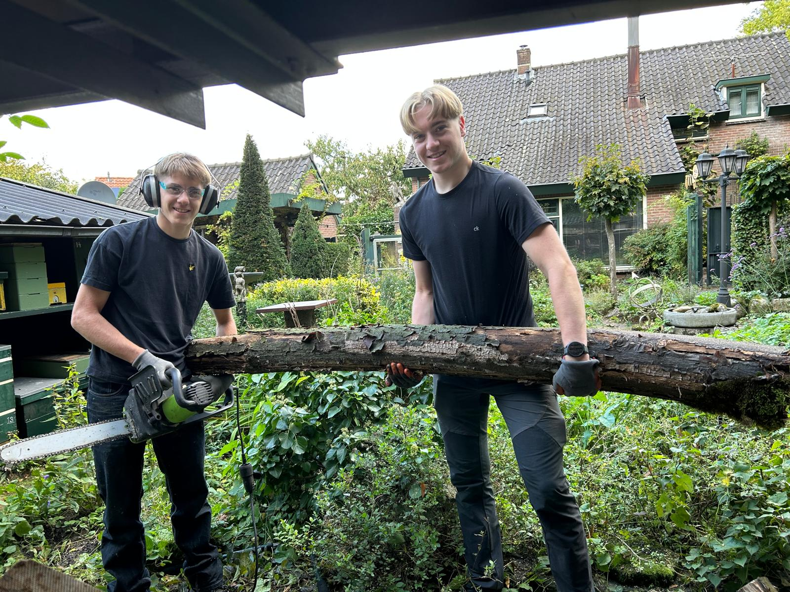

# beauricegroen.github.io
<!DOCTYPE html>
<html lang="nl">
<head>
  <meta charset="utf-8">
  <meta name="viewport" content="width=device-width, initial-scale=1">
  <title>Beauricegroenwerk — Heggen snoeien & Tuinonderhoud</title>
  <meta name="description" content="Beauricegroenwerk — professioneel heggen snoeien, tuinen zomerklaar en winterklaar maken in jouw regio.">
  
</head>
<body>
  <header>
    <h1>Beauricegroenwerk</h1>
    
Uw tuin in goede handen — heggen snoeien, tuinonderhoud, zomerklaar & winterklaar maken

  </header>

  <nav>
    <a href="#diensten">Diensten</a>
    <a href="#portfolio">Portfolio</a>
    <a href="#over">Over mij</a>
    <a href="#contact">Contact</a>
  </nav>

  <main class="container">
    <section class="hero">
      

        <h2>Welkom bij Beauricegroenwerk</h2>
        
Ik ben <strong>Beaurice Dekker</strong>, ervaren hovenier gespecialiseerd in het netjes houden van heggen en het seizoensklaar maken van tuinen. Ik werk snel, netjes en met oog voor detail, zodat uw tuin er altijd verzorgd uitziet.

        
<a class="btn" href="#contact">Vraag een offerte aan</a>

        

          

            <h3>Heggen snoeien</h3>
            
Strak en veilig gesnoeid — voor een nette uitstraling en gezonde hagen.

          

          

            <h3>Tuinen winterklaar maken</h3>
            
Bescherm planten, ruim blad op en maak uw tuin klaar voor de koude maanden.

          

          

            <h3>Tuinen zomerklaar maken</h3>
            
Snoeien, opfrissen en klaarzetten zodat u optimaal van uw tuin kunt genieten.

          

          

            <h3>Onderhoudscontracten</h3>
            
Periodiek onderhoud zodat uw tuin het hele jaar door netjes blijft.

          

        

      

      <aside>
        
        

          <h3>Contact</h3>
          
<strong>Naam:</strong> Beaurice Dekker

          
<strong>Telefoon:</strong> <a href="tel:0612345678">06-12345678</a>

          
<strong>Email:</strong> <a href="mailto:beauricedekker2008@gmail.com">beauricedekker2008@gmail.com</a>

          
<strong>Bedrijf:</strong> Beauricegroenwerk

        

      </aside>
    </section>

    <section id="portfolio">
      <h2>Portfolio — Voor & Na</h2>
      
Bekijk hieronder een impressie van mijn werk. Vervang of breid uit met eigen foto's.

      

        
        
        
      

    </section>

    <section class="over" id="over">
      <h2>Over mij</h2>
      
Ik, Beaurice Dekker, ben de oprichter van Beauricegroenwerk. Met passie voor tuinen en vakmanschap zorg ik dat heggen netjes gesnoeid zijn en dat tuinen klaar zijn voor ieder seizoen.

      <ul>
        <li>Vakmanschap en zorgvuldigheid</li>
        <li>Duidelijke prijzen en heldere afspraken</li>
        <li>Snel en betrouwbaar</li>
      </ul>
    </section>

  </main>

  <footer>
    
&copy; 2025 Beauricegroenwerk — <small>Alle rechten voorbehouden</small>

  </footer>

  <!-- Instructies voor jou:
    - Upload "2476b567-d7ba-47bf-b8a7-8403c8adf8bb.jpg" naar je GitHub repository samen met index.html.
    - Je kunt meerdere foto's toevoegen door ze te uploaden en hun bestandsnaam in de  tags te gebruiken.
    - Daarna: Instellingen → Pagina's → Implementeren vanuit een branch → main → /(root) → Opslaan.
    - Binnen 1 minuut staat je site online!
  -->
</body>
</html>
